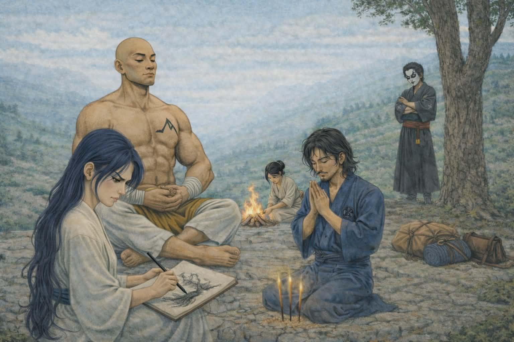

# Legenda o Białym Słowiku

Niegdyś legenda o Białym Słowiku opowiadała o młodym mężczyźnie, który nosił miano Kakita Suro. Samuraja, który na drodze ku zemście przeżył doświadczył oświecenia fortuny Ebisu; w wyniku czego porzucił dawną ścieżkę żyjącego w luksusie Żurawia, aby poświęcić swój żywot obronie heiminów, byciu ich mieczem oraz sprawiedliwością.

Nemezis na jego ścieżce był Bayushi Saburo wraz z swoją linią rodu - od zbrodni młodego, głupiego jeszcze chłopaka zaczęła się cała jego historia: podczas swojego gempukku, mając wpojony obraz nieprawości klanu Skorpiona, zabił w pojedynku treningowym innego małolata, syna pana Saburo - w wyniku czego został wysłany przez własny klan na Pielgrzymkę Wojownika, w celu nabycia pokory i… kary. W tych czasach podjął próby ułożenia sobie życia przy boku córki pana Kitsuki, która jednak stała się celem zemsty klanu Bayushi. Zamordowano ją w przeddzień ich ślubu. Wraz z tym incydentem Kakita Suro podążył ścieżką ku zemście, podczas której stał się też bohaterem heiminów, jako ronin broniąc ich i pomagając wszędzie tam, fakt było to konieczne.

- Postać stworzona około roku 2003 na potrzebę gry u brata. Było to nasze pierwsze podejście do L5R.
- Następnie została podjęta podczas kampanii u Narien u boku Procenta - który grał śledczym Kitsuki.
- Kolejny raz zagrałem Suro podczas pierwszej edycji dramy Kami no Nagai i aktualnie uznaje tą historię za najbardziej kanoniczną mimo dziwnego, niezbyt satysfakcjonującego mnie epilogu.
- Grałem pojedynczą sesję rzekomą córką Suro oraz Skorpionicy z rodziny Bayushi w ramach eksperymentu mechanicznego 4 ed - aby zrobić postać z maksymalnie wysoką inicjatywą.
- Grudzień 2023 rok to moment stworzenia Akari i narodzenia się ów pomysłu na kontynuowanie historii Słowika.

Dzisiaj Białym Słowikiem zdaje się może zostać każdy samuraj, nawet niezależnie od klanu (znana jest opowieść o rzekomo spokrewnionej z nim Skorpionicy z rodu Bayushi) , acz najczęściej zostają nim właśnie uczniowie Dōjō Pojedynków rodziny Kakita. Czas opowiedzieć kolejną historię o odrodzeniu się Hakui no Naichinegru

Akari urodziła się w w domu pana Kakity Fumihito i to po swoim ojcu odziedziczyła zarówno nazwisko, jak i miłość do malarstwa. Chcąc iść w jego ślady (zgodnie z wolą ojca i tradycją rodu) została zapisana do Dōjō Pojedynków rodziny Kakita, gdzie zamierzała skupić się bardziej na drodze artysty - i to poprzez nią reprezentować klan, jak i mierzyć się z konkurentami - miecz traktując zaś dodatkowo i poświęcając mu mniej uwagi. Szermierka, polityka czy sztuka wojny były obowiązkiem, który nie wywoływał przykrości; szczególnie, że towarzyszyły im lekcje malarstwa czy ikebany.

Małżeństwo pana Fumihito z panią Kokoro, najmłodszą z córek Matsu Natsumi - będące owocem porozumienia kończącego pewien niewielki, lokalny konflikt między powyższymi - nie należało do najłatwiejszych. Dowodem było chociażby to, że po urodzeniu się drugiego dziecka (pierwszego chłopaka, młodszego brata Akari, mającego aktualnie przed sobą gempukku) para nie chciała starać się o dalszych potomków. Za plecami domowników służba lubiła mówić, że pan Kakita czekał na syna, a jego czcigodna małżonka na córkę, oboje więc byli już spełnieni. Kokoro dołożyła jednakże starań, aby jej pierworodna nauczyła się również podstaw wojennej tradycji rodziny Matsu, na co ojciec przymykał oko… dla zwykłego, czystego spokoju, bacząc na temperament “Lwicy w błękitnym kimonie”.

Powyższe osoby i ich wpływ nie wywołały jednak u młodej samurai-ko konfliktu. Ten pojawił się jednak w trakcie pierwszych lat nauczania, kiedy to objawił się jej duch jej przodka, znanego jako Biały Słowik - aby wskazać jej niespodziewaną i nieplanowaną ścieżkę… która stała daleko od jej osobistych pragnień.

Nagłe skupienie się dziewczyny na szermierce przydatnej raczej na trakcie i podczas walki z bandytami niźli na salonowych pojedynkach, mniejsza uwaga na lekcjach sztuki i kultury wyższej, nagłe zainteresowanie folklorem oraz geografią było zaskoczeniem dla wszystkich. Akari nie przyznała się jednak przed nikim o prowadzącym ją przodku, czując wewnętrzną złość i żal… może też nadzieję powrotu, który nie nadchodził? Dopiero kiedy ojciec zadbał, aby szermierki uczył ją stary przyjaciel rodziny, sensei Dōjō Mirumoto o podobnej filozofii jaką nagle zdawała się zainteresować dziewczyna - zaprzyjaźniła się z nim i ostatecznie wyznała mi prawdę o Białym Słowiku. Czemu zaskoczyło ją, kiedy okazało się, że jej mistrz znał niegdyś człowieka posługującego się owym pseudonimem?

To za jego sprawą styl walki młodej malarki ewoluował w stronę sztuki Nitten. Zresztą, pomógł jej również zaakceptować nową drogę - choć do dzisiaj czuje konflikt między giri, a ninjo. Podstawy wprowadził jednak do kanonu jej nauk poprzez malarstwo, ucząc malować pierw prawą, potem lewą, by w końcu oboma rękoma. Dopiero z czasem zauważyła, że stary mistrz był przebiegły, ucząc ją w ten sposób podstaw kata. Ostateczne podczas turnieju z okazji gempukku poradziła sobie na tyle dobrze, by przynieść dumę swojemu Dōjō oraz rodowi.

Jej daimyō zdawał się również zauważać jej przeznaczenie. Białe kimono zwiastujące śmierć, maska z origami, sakkat i podróżny płaszcz miał stać się jej atrybutami w miejsce pałacowego życia pełnego sztuki i komfortu. Tak oto ponownie miała odrodzić się Legenda o Białym Słowiku, pobłogosławionym przez Ebisu by strzec prostego ludu przed tyranami którzy zapomnieli o przeznaczeniu Niebiańskiego Porządku.

…i tu wędruje akurat w miejsce kompanii naszego MG
Niżej już tylko uwagi mechaniczne do karty, która znajduje się w osobnym pliku.

# Historia zbroi rodziny Matsu Natsumi

Rodzina powyższej szczyciła się długą historią szermierek, konkurującym czasem również z rodem Kakita mojego ojca.

Rywalizacja ta najczęściej zamykała się na salonach i przechwałkach, ale co najważniejsze: "drodze pędzla". Z racji osobliwej tradycji obu rodzin, mistrzowskiej jakości pędzle w rodzinie Matsu były przekazywane najstarszej córce, która kontynuowała tradycje, zaś starą już lekką zbroje najmłodszej, albowiem ta miała pełnić tradycyjnie rolę yojimbo.

Fortuny jednak zdecydowały się złamać wiekowy zwyczaj rodziny.

Kiedy dziadkowie Akari po raz któryś stanęli do malarskiego pojedynku, natura Matsu przeważyła - oskarżyła ojca pana Fuhimito o plagiat, co eskalowało tak bardzo, iż skończyło się konfliktem szermierczym, który Lwica przegrała.

W walce jednak dziadek Akari stracił dwa palce, co zakończyło jego karierę malarską. W ramach zadośćuczynienia i przywrócenia pokoju rodzina Matsu zaproponowała ich krew wybitnych malarzy połączy się poprzez małżeństwo.

Pech jednak chciał, iż Lwica miała tylko dwie córki. W wyniku sytuacji tradycyjna zbroja powinna stać się własnością Żurawi, na co oczywiście kobieta się nie zgodziła. Pancerz pozostał w rękach Matsu. Oczywiście, pani Natsumi jest tym faktem urażona, ale co miała zrobić? Wyzwać babkę lub siostrę na pojedynek? Jej mężowi zaś bardziej zależało na pokoju, więc zostawił tą sprawę.
Małżeństwo oczywiście było chwalebne. W końcu połączyły się rody wybitnych malarzy. Jakie miało znaczenie, że akurat Natsumi uczyła się na wojownika, a nie artystę, jako młodsza córka? Żadne. Jej starsza córka nie mogła wejść w małżeństwo na gorszych zasadach, była bowiem dziedzicem. Zbroja jednak nie została przekazana zgodnie ze zwyczajem.

*Uzasadnienie wylosowanej cechy dającej +5 do honoru i chwały w zamian za utraconą Lacquered Armor* 

# My Site

## Create, Share and Collaborate

Here is some sample **Markdown** content.  

Go to [topic-1](topic-1.md)

Go to [topic-2](topic-2.md)

Go to [topic-3](topic-3.md)
